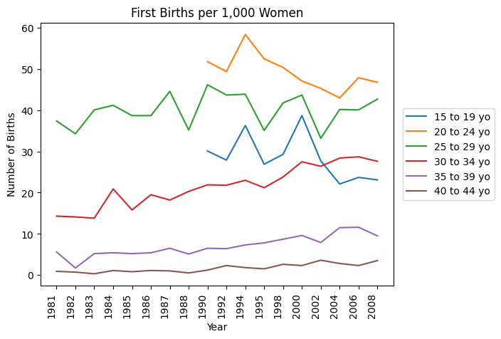
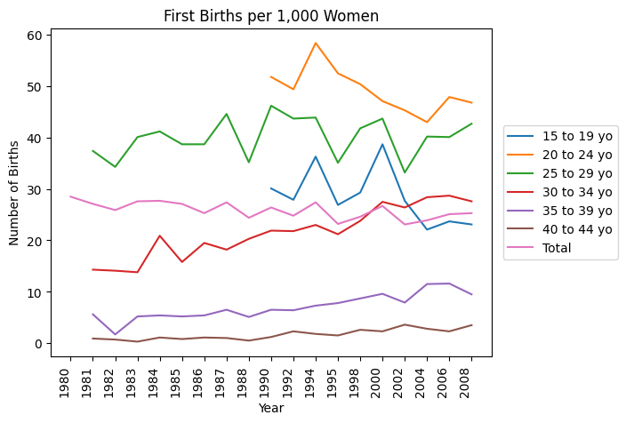
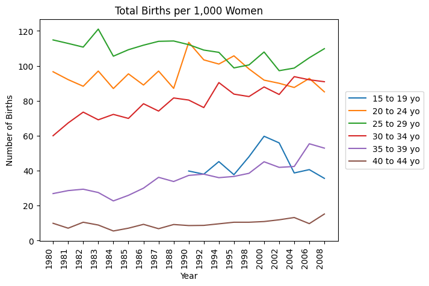
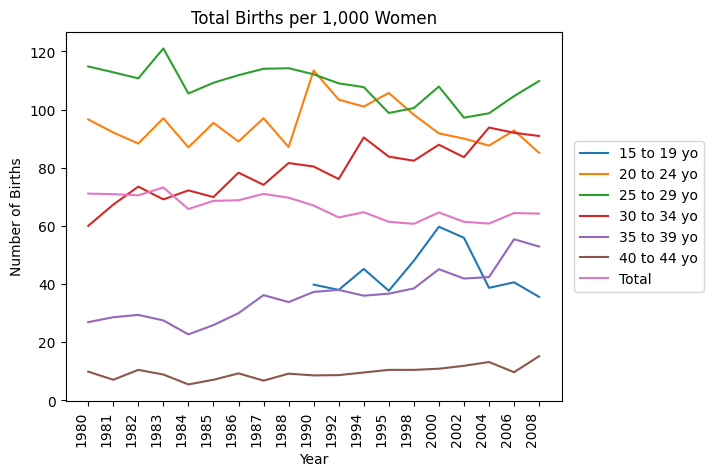

# HW 4 - CS 625, Fall 2023

Eikra Shithil 
Due: October 27, 2023

## Dataset 1

## First Births by Age

I have written a python code to help me plot the data. This data shows the number of first births out of 1000 women and the age they have their first birth.

From the observations of this line plot, we see a steady increase in the number of first births among women aged: 30 to 34, 35 to 39 and even 40 to 44. The most increase being in in the 30 to 34 age group. 

In contrast, we can see a slight decrease in the number of first birth among the age groups: 15 to 19 and 20 to 24. This decrease being the most prominent from 2000 to 2008. 

The age group that has stayed consistent is women ages 25 to 29. There has not been a trend of increase or decrease of the number of first births in this age group. 

I have added a second plot to show the total number of first births in all the age groups in the second plot. The total shows that the number of first births in general has also seen a decrease since 1980

### Line Plot for first births out of 1000 women by age





## Total Births by Age

This data shows the number of total births out of 1000 women and the age of the women.

From the observations of this line plot, we see a steady increase in the number of total births among women aged: 30 to 34, 35 to 39 and even 40 to 44. The most increase being in in the 35 to 39 age group. 

In contrast, we can see a slight decrease in the number of total birth among the age groups: 15 to 19 and 25 to 29. 

The age group that has stayed relatively consistent is women ages 20 to 24. There has not been a trend of increase or decrease of the number of total births in this age group. 

I have added a second plot to show the total number of total births in all the age groups in the second plot. The total shows that the number of total births in general has also seen a decrease since 1980. 

These trends are very similar to the "first births" charts.

### Line Plot for total births out of 1000 women by age





### Python Code

```{python}

```

## Conclusion

In conslusion, this data shows us that women are waiting longer to have children. The 30s are seeming more like the 20s when it comes to the time of first births and total births. The overall birth rate is also decreseing as less women are per 1000 women are having children. 


## References

* Reference 1, <https://builtin.com/data-science/matplotlib-legend-outside-plot>
* Reference 2, <https://www.w3schools.com/python/matplotlib_labels.asp>
* Reference 3, <https://stackoverflow.com/questions/68917921/converting-object-type-column-to-float-type-converts-all-to-nan>
* Reference 4, <https://www.geeksforgeeks.org/line-chart-in-matplotlib-python/#>
* Reference 5, <https://stackoverflow.com/questions/20461165/how-to-convert-index-of-a-pandas-dataframe-into-a-column>
* Reference 6, <https://stackoverflow.com/questions/7744697/how-to-show-two-figures-using-matplotlib>
* Reference 7, <>
* Reference 8, <>
* Reference 9, <>
* Reference 10, <>
